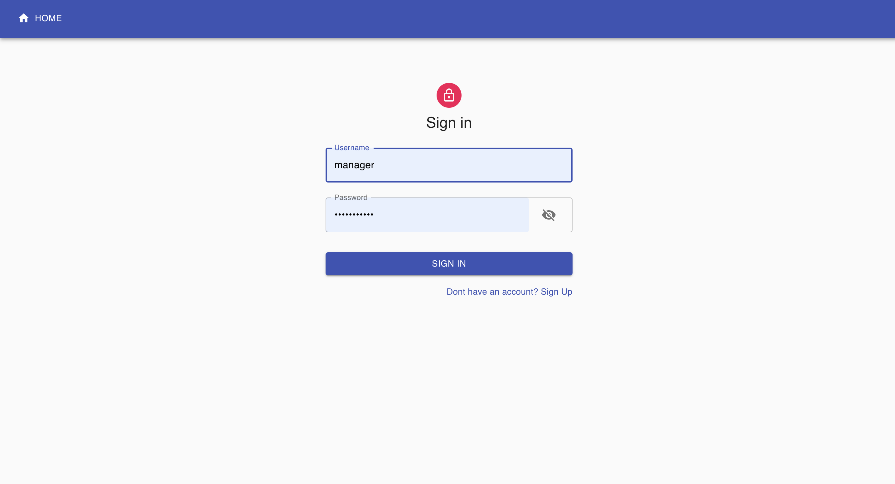
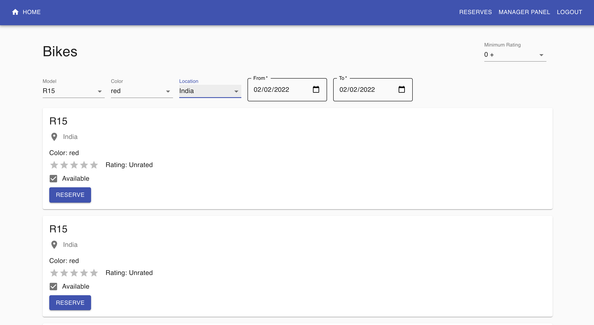
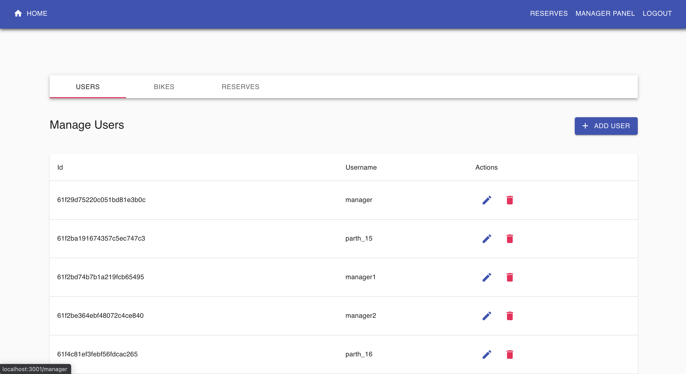
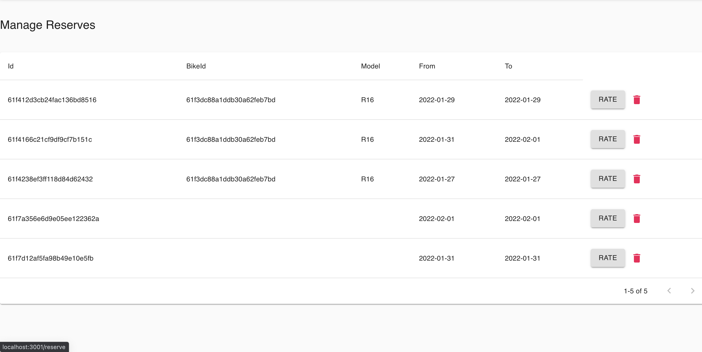

# Project Name & Pitch

Bike Rental Management
An application showing bikes available for rentals based on filter functionality, allowing users to reserve bike for specific timeframe alongwith giving rate of bike which was reserved.

# Project Status

Completed

# Project Screen Shot

# Installation and Setup Instructions

Clone down this repository. You will need `node` and `npm` installed globally on your machine.

## How to run

- Create `backend/.env` file from the `backend/example.env` file and populate values for those variables.
- To navigate to backend directory use `cd backend/` from `root` directory.
- Install all the backend dependencies using `npm install` in backend directory.
- Run backend in development mode using command `npm run dev`.
- To navigate to frontend directory use `cd frontend/` from `root` directory.
- Run frontend in development mode using command `npm start`.

## Tech Stack

Used number of open source projects to work properly:

- For frontend:

  - React
  - Material UI

- For backend:
  - Node.js (Express)
  - MongoDB with Mongoose
